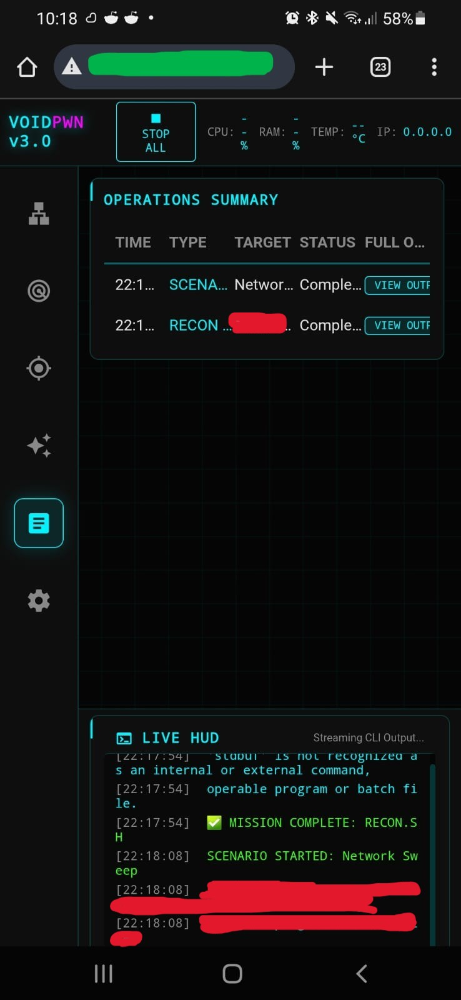

<p align="center">
  
</p>

<p align="center">
  <a href="https://opensource.org/licenses/MIT"></a>
  <a href="https://www.raspberrypi.org/"></a>
  <a href="https://www.python.org/"></a>
</p>

<p align="center">
  <b>VoidPWN</b> is an automated network security assessment framework engineered for portability and field efficiency. It consolidates industry-standard security tools into a unified, web-based Command & Control (C2) interface, enabling operators to execute complex network discovery, wireless auditing, and automated exploitation scenarios with precision.
</p>

---

# VoidPWN: Automated Penetration Testing Platform
## Advanced Network Security Auditing for Raspberry Pi
> *A professional-grade toolkit for automated reconnaissance, wireless auditing, and field operations.*

---

<p align="center">
  
</p>

---

## 💻 Multi-Platform Operational HUD
VoidPWN provides a responsive, operator-centric web interface accessible across your entire tactical stack. Control your mission from a **Raspberry Pi TFT**, a **Workstation**, or a **Mobile Device** with real-time synchronization.

<p align="center">
  
  <br>
  <i>Synchronized mobile-based operation logs showing real-time mission telemetry.</i>
</p>

### 🛡️ Network Intel & Reconnaissance
Deploy sophisticated **Nmap** profiles for rapid host discovery, service enumeration, and vulnerability mapping. Built-in OS fingerprinting and port discovery provide immediate situational awareness.
<p align="center">
  
</p>

### 📡 Wireless Attack Arsenal
Execute advanced wireless vectors including **WPA/WPA2 Handshake capture**, **PMKID extraction**, **Evil Twin** deployment, and **MDK4-based stress testing**—all through a tactical, streamlined workflow.
<p align="center">
  
</p>

### 📊 Tactical Data & Live Logging
Monitor every phase of the operation through the **Live HUD**, featuring terminal-synchronized log streaming. Post-mission analysis is simplified through comprehensive, downloadable session reports.
<p align="center">
  
</p>

### ⚙️ Modular Operation Management
The intuitive HUD allows seamless switching between reconnaissance, active attacks, system configuration, and data management, ensuring the operator remains focused on the mission objective.
<p align="center">
  
</p>

---

## 🛠️ Operational Capabilities

### 🔍 Intelligence & Recon
*   **Packet Analysis**: Automated service discovery and OS identification.
*   **Vulnerability Scanning**: Targeted Nmap scripts for rapid surface analysis.
*   **Web Fuzzing**: Integrated GoBuster for directory and asset discovery.

### 📶 Wireless Dominance
*   **Automated Auditing**: Wifite integration for high-success wireless penetration.
*   **Protocol Exploitation**: WPA/WPS attack vectors and deauthentication channel locking.
*   **Signal Analysis**: Real-time signal strength and target metadata tracking.

### 🤖 Scenario Automation
*   **Rapid Assessment**: 5-minute pre-configured network check.
*   **Stealth Recon**: Low-profile scanning utilizing decoy traffic.
*   **Full Wireless Audit**: End-to-end automated WiFi penetration workflow.

### 🖥️ Operator Interface
*   **Live HUD**: Sub-second latency attack monitoring and log visualization.
*   **C2 Dashboard**: Global "Stop All" kill-switch and device inventory management.
*   **Display Logic**: Seamless SPI TFT and HDMI output switching.

---

## 📦 Hardware & Deployment

### Recommended Build
| Component | Specification | Description |
| :--- | :--- | :--- |
| **Processor** | Raspberry Pi 4B (4GB+) | Core computational unit for concurrent scanning. |
| **Radio** | Alfa AWUS036ACH | Dual-band support with RTL8812AU injection. |
| **Display** | Waveshare 3.5" TFT | Local field monitoring and touch-enabled HUD. |
| **Storage** | 32GB+ UHS-I microSD | High-speed logging and handshake storage. |

### Quick Installation
1. **Initialize Environment**: Clone the repository and navigate to the project root.
   ```bash
   git clone https://github.com/void0x11/VoidPWN.git && cd VoidPWN
   ```
2. **Setup Dependencies**: Install the core security engine and optional TFT drivers.
   ```bash
   sudo ./scripts/core/setup.sh
   sudo ./scripts/core/install_lcd.sh # Optional: Reboot required
   ```
3. **Launch HUD**: Execute the C2 server with root privileges.
   ```bash
   cd dashboard && sudo python3 server.py
   ```

---

## 📚 Documentation

### User Guides
- **[Operation Manual](./USER_GUIDE.md)**: Full field guide for security operators.
- **[Hardware Setup](./docs/HARDWARE_SETUP.md)**: Detailed hardware assembly and configuration.

### Feature Documentation
- **[Feature Catalog](./docs/FEATURE_GUIDE.md)**: In-depth technical breakdown of every module.
- **[WiFi Methodologies](./docs/WIFI_ARSENAL.md)** / **[Recon Techniques](./docs/NETWORK_INTEL.md)**.
- **[Scenario Guide](./docs/SCENARIO_GUIDE.md)**: Automated workflow documentation.

### Technical Reference
- **[Architecture & Design](./docs/TECHNICAL_REFERENCE.md)**: System internals and component orchestration.
- **[Attack Catalog](./docs/ATTACK_REFERENCE.md)**: Details on implemented attack vectors.

---

## 🚀 Quick Example

### Running a WiFi Handshake Capture

1. **Navigate to WiFi Attacks tab**.
2. **Click "REFRESH NETWORKS"** to scan for access points.
3. **Select target network** from the list.
4. **Click "HANDSHAKE"** to initiate capture.
5. **Monitor progress** in the Live HUD.
6. **View results** in the Reports tab.

---

## 🔒 Legal & Ethical Compliance
**VoidPWN is an authorized security research platform.** Use is permitted only on infrastructure where the operator has explicit, written authorization. All data gathered must be handled according to local data protection laws. The developers assume no liability for unauthorized or misuse of this software.

---

## 📄 License
This project is licensed under the MIT License - see the [LICENSE](LICENSE) file for details.

---

## 👤 Maintainer
**void0x11** - [GitHub Profile](https://github.com/void0x11) | Developed for Advanced Security Auditing.

---

## 🙏 Acknowledgments
- **Aircrack-ng Suite**: Wireless security assessment tools.
- **Nmap Project**: Network discovery and security auditing.
- **Reaver/Pixiewps**: WPS vulnerability research.
- **Wifite**: Automated wireless auditing framework.
- **Flask**: Python web framework.
- **Raspberry Pi Foundation**: Affordable computing platform.

---

*Developed for authorized security research and ethical penetration testing.*
