<h1 align="center">
  
</h1>

<p align="center">
  
</p>

<p align="center">
  <a href="https://opensource.org/licenses/MIT"></a>
  <a href="https://www.raspberrypi.org/"></a>
  <a href="https://www.python.org/"></a>
  
  
</p>

<p align="center">
  
</p>

<p align="center">
  <b>VoidPWN</b> is a high-performance, mobile-optimized Command-and-Control (C2) framework engineered for <b>Hardware Security Assessments</b> and <b>Enterprise Network Auditing</b>. It streamlines complex network discovery and wireless security assessments by consolidating advanced audit vectors into a unified Raspberry Pi hardware platform.
</p>


---

## 🏗️ Full-Stack System Architecture

VoidPWN is engineered as a **Modular Security Orchestrator**, decoupling the high-level Command & Control (C2) interface from the underlying execution engines and hardware abstraction layers. The system integrates over 20+ specialized security tools into a unified, automated framework.

### [ SYSTEM_SCHEMATIC ]


### [ TECHNICAL_LAYER_SPECIFICATIONS ]

| Layer | Component | Integrated Tooling & Technologies |
| :--- | :--- | :--- |
| **L4: Presentation** | **Dashboard** | Python Flask, Jinja2, Socket.IO, Vanilla JS, CSS3 Grid |
| | **CLI** | Bash 5.0+, Interactive Menu System, Colorized Output |
| **L3: Orchestration** | **Process Mgmt** | `subprocess` (Python), `stdbuf` (Unbuffered I/O), `collections.deque` |
| | **Data Parsing** | Regex Heuristics (Live Stream), `xml.etree` (Nmap XML), `json` |
| **L2: Execution** | **Wireless** | `aircrack-ng`, `aireplay-ng`, `airodump-ng`, `wifite`, `mdk4`, `hcxdumptool`, `reaver`, `pixiewps`, `macchanger` |
| | **Network** | `nmap` (NSE), `gobuster`, `enum4linux`, `smbclient`, `arp-scan`, `dirb`, `tshark` |
| **L1: Infrastructure** | **Drivers** | `88xxau-dkms` (Monitor Mode), `LCD-show` (SPI), `fbcp` (Display Mirroring) |
| | **OS/Kernel** | Kali Linux / Raspberry Pi OS (Debian 12 Bookworm), Kernel 6.x |
| **L0: Physical** | **Compute** | **Raspberry Pi 4B**: Broadcom BCM2711, Quad-core Cortex-A72 (ARM v8) 64-bit SoC @ 1.5GHz |
| | **RF Interface** | **Alfa AWUS036ACH**: Realtek RTL8812AU Chipset, USB 3.0, Dual-Band 2.4/5GHz, High-Gain Antennas |
| | **Display** | **Waveshare 3.5" TFT**: SPI Interface (MHz), XPT2046 Touch Controller |
| | **Power** | **PiSugar / UPS**: I2C Battery Monitoring, 5V/3A Output Regulation via USB-C |

### [ RF_PHYSICAL_LAYER_ANALYSIS ]

VoidPWN operates at the **Layer 0 (Physical)** and **Layer 1 (Data Link)** intersection, manipulating raw 802.11 frames directly from the air interface. The following schematic illustrates the bidirectional signal mechanics between the VoidPWN engine and the target infrastructure.

```mermaid
sequenceDiagram
    participant Target as 🎯 Target Network
    participant Air as 🌊 RF Spectrum (Air Interface)
    participant Ant as 📡 High-Gain Antenna
    participant PHY as 🎛️ RTL8812AU (PHY/MAC)
    participant Drv as 🔌 Driver (88xxau)
    participant Void as 👾 VoidPWN Engine

    Note over Target, Void: 🟡 RX PATH: Monitor Mode (Passive Intelligence)
    Target->>Air: 802.11 Beacon Frames (100ms)
    Target->>Air: Data Packets / Probes
    Air->>Ant: RF Signal (2.412 GHz / 5 GHz)
    Ant->>PHY: Analog Carrier Wave
    PHY->>Drv: Demodulation (ADC/OFDM)
    Drv->>Void: Radiotap Header + 802.11 Frame
    Void->>Void: Regex Analysis (Identify Target)

    Note over Target, Void: 🔴 TX PATH: Active Injection (Attack Vector)
    Void->>Drv: Construct Deauth Packet (Reason: 7)
    Drv->>PHY: Frame -> IQ Samples
    PHY->>Ant: Modulation (CCK/OFDM via DAC)
    Ant->>Air: High-Power Injection (30dBm)
    Air->>Target: Deauthentication Frame
    Target->>Target: Connection Drop (DoS)
    
    Note over Target, Void: 🟢 HANDSHAKE CAPTURE
    Target->>Air: EAPOL 4-Way Handshake (Reconnection)
    Air->>Ant: Capture Transient Frames
    Ant->>PHY: Standard RX Path
    PHY->>Void: Save to .cap (PMKID/MIC Extraction)
```



**Signal Processing Mechanics:**
1.  **Signal Acquisition (RX)**: The **RTL8812AU** chipset operates in *Promiscuous Monitor Mode*, bypassing standard MAC filtering to capture all raw 802.11 frames within the antenna's sensitivity range.
2.  **Demodulation**: Physical signals (OFDM for 802.11ac, CCK for 802.11b) are converted by the PHY's **ADC (Analog-to-Digital Converter)** into digital baseband signals.
3.  **Injection (TX)**: For active attacks (Deauth/Beacon Flood), the engine bypasses the kernel's regulatory domain constraints to drive the amp at **30dBm (1000mW)**, saturating the local air interface to ensure frame delivery.


### [ SYSTEM_LIFECYCLE_LOGIC ]
The workflow for a standard security assessment (e.g., "Network Reconnaissance") across the stack:


---

## 🔬 Engineering & Technical Implementation

### Asynchronous C2 Orchestration
VoidPWN utilizes a **Threaded Producer-Consumer** pattern for efficient process management. By leveraging `stdbuf -oL`, the framework forces binaries such as `nmap` and `airodump-ng` to bypass standard memory buffering. this enables **millisecond-latency interface updates**, providing real-time visibility into long-running assessment processes.

### Real-time Intelligence Extraction
The framework incorporates a **Regex-based Heuristic Engine** (`parse_inventory_info`) that audits live process output in real-time to identify:
- **Network Topology Artifacts**: Automatically populating the host inventory from active scanning results.
- **Physical Device Signatures**: Extracting MAC addresses and BSSID identifiers for localized device tracking.

### Hardware Abstraction Layer
The display engine facilitates dynamic switching between the HDMI output and the SPI-based TFT interface. This is achieved through direct modification of the `/boot/config.txt` parameters and re-initialization of the `fbcp` (framebuffer copy) service, enabling seamless transitions between portable and workstation-based operational modes.

---

## 💻 Cross-Platform Operational Interface
VoidPWN provides a responsive, web-based Command-and-Control interface accessible across diverse hardware stacks. Researchers can manage assessments from a **Raspberry Pi TFT**, a **Standard Workstation**, or a **Mobile Device** with full real-time synchronization.

<p align="center">
  
  <br>
  <i>Synchronized mobile interface showing real-time system logs and process telemetry.</i>
</p>

### 🛡️ Network Infrastructure Enumeration
Deploy sophisticated **Nmap** profiles for rapid host discovery and network mapping. Integrated OS fingerprinting and service discovery provide comprehensive situational awareness during internal security audits.
<p align="center">
  
</p>

### 📡 Wireless Security Suite
Execute advanced wireless assessment vectors including **WPA/WPA2 Handshake capture**, **PMKID extraction**, and **Authorized Rogue AP** simulations. Optimized for auditing protocol resilience and credential management.
<p align="center">
  
</p>

### 📊 Real-time Assessment Logs
Monitor long-running processes through the **Live Interface**, featuring synchronized log streaming. Post-assessment analysis is facilitated through comprehensive, exportable session reports.
<p align="center">
  
</p>

### [ SYSTEM_MODALITIES ]
*   **INFRA_RECON**: Automated network mapping and host profiling.
*   **WIRELESS_AUDIT**: WPA/WPA2 protocol resilience and handshake acquisition.
*   **AUTOMATED_ASSESSMENT**: Condition-based security sequences for rapid auditing.
*   **REMOTE_C2**: Web-integrated telemetry and remote platform management.

---

## 🔬 Assessment Methodologies

### [ RECON_LOGIC ]
VoidPWN utilizes optimized **Nmap T3/T4** profiles for thorough perimeter analysis. Assessment phases include:
1. **Network Discovery**: ICMP/ARP sweeps for inventory building via `nmap -sn`.
2. **Service Enumeration**: Comprehensive version detection (`-sV`) and OS fingerprinting (`-O`).
3. **Vulnerability Mapping**: Targeted NSE (Nmap Scripting Engine) execution for known service weaknesses.
4. **Web Recon**: Directory and asset discovery using **GoBuster**.

### [ WIRELESS_SECURITY_LOGIC ]
The wireless assessment engine automates the 802.11 audit lifecycle:
*   **WPA/WPA2 Resilience**: Automated handshake acquisition via `airodump-ng` and `aireplay-ng`.
*   **Clientless PMKID**: Targeted RSN audit using `hcxdumptool` to bypass deauthentication needs.
*   **WPS Auditing**: Online and offline (Pixie-Dust) brute-force via `reaver`.
*   **Protocol Stress-Testing**: High-volume Beacon and Auth flooding using `mdk4`.
*   **Authorized Rogue AP**: Deployment of test-specific access points using `airbase-ng` or `wifiphisher`.

---

## ⚒️ Security Assessment Capabilities

### Network Intelligence
*   **Service Analysis**: Automated host discovery and infrastructure profiling.
*   **Stealth Scanning**: Fragmented packet headers (`-f`) and decoy traffic (`-D`) to evade IDS/IPS.
*   **Artifact Extraction**: Direct parsing of Nmap XML results into the unified inventory.

### Wireless Research
*   **Automated Auditing**: **Wifite**-powered workflows for streamlined protocol testing.
*   **Cracking Integration**: Ready-to-crack `.cap` and `.pcapng` export for **Hashcat/John**.
*   **Spectrum Analysis**: Real-time monitoring of signal density and target metadata.

### Automation & Workflows
*   **Rapid Audit**: Pre-configured network assessment routines (~5 minutes).
*   **Condition-Based Sequences**: Sequential attacks (e.g., Scan -> Identify -> Deauth -> Capture) via `scenarios.sh`.
*   **Remote C2**: Web-integrated telemetry and remote platform management.

---

## Hardware & Deployment

### Recommended Physical Specification
| Component | Specification | Technical Detail |
| :--- | :--- | :--- |
| **SBC** | Raspberry Pi 4B (4GB/8GB) | SoC: BCM2711 (Quad-core Cortex-A72) |
| **Radio (Primary)** | Alfa AWUS036ACH | Chipset: RTL8812AU (Injection + Monitor Mode) |
| **Display Interface** | Waveshare 3.5" TFT | Connection: SPI (GPIO Header), Resolution: 480x320 |
| **Storage** | 32GB+ UHS-I microSD | Endurance rating: 100MB/s+ for high-speed logging |
| **Management RF** | Built-in RPi WiFi | Dedicated wlan0 for C2 Dashboard access |
| **Power Management** | PiSugar 2/3 (Optional) | Integrated UPS for portable field operations |

### [ SYSTEM_INITIALIZATION ]

1. **PROVISION_FILES**:
   ```bash
   # Clone security framework
   git clone https://github.com/void0x11/VoidPWN.git && cd VoidPWN
   ```
2. **RESOLVE_DEPENDENCIES**:
   ```bash
   # Deployment of core security engines and hardware drivers
   sudo ./scripts/core/setup.sh
   sudo ./scripts/core/install_lcd.sh
   ```
3. **START_FRAMEWORK**:
   ```bash
   # Initializing the C2 Dashboard
   cd dashboard && sudo python3 server.py
   ```

---

## 📚 Documentation

### User Guides
- **[Operation Manual](./USER_GUIDE.md)**: Comprehensive guide for security researchers.
- **[Hardware Setup](./docs/HARDWARE_SETUP.md)**: Detailed hardware assembly and configuration.

### Feature Documentation
- **[Feature Catalog](./docs/FEATURE_GUIDE.md)**: In-depth technical breakdown of every module.
- **[WiFi Methodologies](./docs/WIFI_ARSENAL.md)** / **[Recon Techniques](./docs/NETWORK_INTEL.md)**.
- **[Scenario Guide](./docs/SCENARIO_GUIDE.md)**: Automated workflow documentation.

### Technical Reference
- **[Architecture & Design](./docs/TECHNICAL_REFERENCE.md)**: System internals and component orchestration.
- **[Attack Catalog](./docs/ATTACK_REFERENCE.md)**: Details on implemented attack vectors.

---

## Quick Example

### Running a WiFi Handshake Capture

1. **Navigate to Wireless tab**.
2. **Initialize Spectrum Refresh** to identify target access points.
3. **Select target network** for assessment.
4. **Initialize Handshake Acquisition** to start the capture process.
5. **Monitor Telemetry** in the Live Interface.
6. **View results** in the Reports tab.

---

## Legal & Ethical Compliance
**VoidPWN is security research platform.** Use is permitted only on infrastructure where the operator has explicit, written authorization. All data gathered must be handled according to local data protection laws. The developers assume no liability for unauthorized or misuse of this software.

---

## License
This project is licensed under the MIT License - see the [LICENSE](LICENSE) file for details.

---

## Maintainer
**void0x11** - [GitHub Profile](https://github.com/void0x11) | Research and Development for Advanced Security Auditing.

---

## Acknowledgments
- **Aircrack-ng Suite**: Wireless security assessment tools.
- **Nmap Project**: Network discovery and security auditing.
- **Reaver/Pixiewps**: WPS vulnerability research.
- **Wifite**: Automated wireless auditing framework.
- **Flask**: Python web framework.
- **Raspberry Pi Foundation**: Affordable computing platform.

---

*This project is developed for authorized security assessments and educational purposes.*
