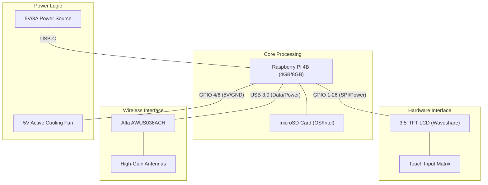
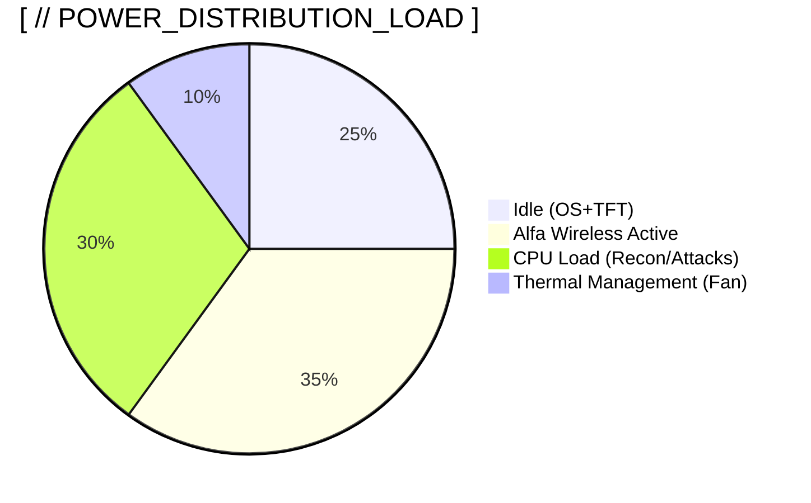

# 🛠️ HARDWARE_SPECIFICATION // VOID_PWN PLATFORM

This document provides detailed assembly schematics and configuration protocols for the VoidPWN mobile platform.

---

## [ // BILL_OF_MATERIALS ]

### Core Components

| Component | Model/Specification | Technical Role | 
| :--- | :--- | :--- |
| **SBC** | Raspberry Pi 4 Model B (4GB+ RAM) | Primary compute module |
| **TFT_DISPLAY** | Waveshare 3.5" LCD (480x320) | Local system interface |
| **RF_ADAPTER** | Alfa AWUS036ACH (RTL8812AU) | Wireless auditing interface |
| **STORAGE** | 32GB+ microSD Card (UHS-I) | System OS & Intelligence logging |
| **POWER_UNIT** | Official RPi 4 USB-C (5V/3A) | Standard power supply |
| **SYSTEM_CASE** | RPi 4 Case with Active Cooling | Thermal regulation |

---

## [ // HARDWARE_ASSEMBLY ]

### System Interconnectivity



### Assembly Workflow


### Step 1: Raspberry Pi Preparation

#### 1.1 Install Heat Sinks (if included with case)
- Apply heat sinks to CPU, RAM, and USB controller chips
- Ensure thermal pads make full contact with components

#### 1.2 Install Cooling Fan
- Connect fan to GPIO pins 4 (5V) and 6 (GND)
- Secure fan to case with provided screws
- Verify airflow direction (should blow over CPU)

#### 1.3 Insert microSD Card
- Flash Raspberry Pi OS or Kali Linux ARM to microSD
- Insert card into slot on underside of Pi
- Ensure card clicks into place

### Step 2: TFT LCD Installation

#### 2.1 Physical Connection
The Waveshare 3.5" TFT connects via GPIO pins:

```
TFT Pin Layout (GPIO Header):
┌─────────────────────────────┐
│  3.5" TFT LCD Display       │
│  (Waveshare Compatible)     │
└─────────────────────────────┘
         │
         │ (GPIO 1-26)
         ▼
┌─────────────────────────────┐
│   Raspberry Pi 4 GPIO       │
└─────────────────────────────┘
```

**Installation Steps:**
1. Power OFF the Raspberry Pi completely
2. Align TFT screen with GPIO pins 1-26
3. Gently press down until fully seated
4. Verify no pins are bent or misaligned

#### 2.2 Driver Installation
The TFT drivers are installed via the `install_lcd.sh` script:

```bash
sudo ./scripts/core/install_lcd.sh
```

**What this script does:**
- Clones LCD-show-kali drivers from GitHub
- Configures SPI interface for display communication
- Modifies `/boot/config.txt` for TFT parameters
- Automatically reboots to apply changes

**After reboot:**
- Display output switches from HDMI to TFT
- Touch input is automatically configured
- Resolution is set to 480x320

#### 2.3 Switching Between TFT and HDMI
Use the dashboard's **SYSTEM** tab:
- **"SWITCH TO TFT"**: Runs `install_lcd.sh` (reboots to TFT)
- **"SWITCH TO HDMI"**: Runs `restore_hdmi.sh` (reboots to HDMI)

### Step 3: WiFi Adapter Setup

#### 3.1 Alfa AWUS036ACH Specifications
- **Chipset**: Realtek RTL8812AU
- **Bands**: Dual-band (2.4GHz & 5GHz)
- **Standards**: 802.11a/b/g/n/ac
- **TX Power**: Up to 30dBm (1000mW)
- **Antenna**: Detachable 5dBi dual-band

#### 3.2 Physical Connection
1. Connect Alfa adapter to USB 3.0 port (blue port)
2. Attach external antenna to SMA connector
3. Verify LED indicator lights up (solid = connected)

#### 3.3 Driver Installation
The RTL8812AU driver is installed via setup script:

```bash
sudo ./scripts/core/setup.sh
```

**Manual driver installation (if needed):**
```bash
git clone https://github.com/aircrack-ng/rtl8812au.git
cd rtl8812au
make
sudo make install
sudo modprobe 88XXau
```

#### 3.4 Verify Monitor Mode Support
```bash
sudo airmon-ng check kill
sudo airmon-ng start wlan1
iwconfig  # Should show wlan1mon interface
```

**Expected output:**
```
wlan1mon  IEEE 802.11  Mode:Monitor  Frequency:2.457 GHz
          Tx-Power=20 dBm
          Retry short limit:7   RTS thr:off   Fragment thr:off
          Power Management:off
```

### Step 4: Power Configuration

#### 4.1 Stationary/Laboratory Setup
- Use official Raspberry Pi 4 USB-C power supply (5V/3A)
- Connect to standard outlet for sustained system analysis
- Ensure power supply is rated for 15W continuous

#### 4.2 Portable/Field Testing Setup
- Use 20,000mAh+ USB-C power bank
- Verify output: 5V/3A (15W minimum)
- Recommended: Anker PowerCore or RAVPower models
- Expected runtime: 4-6 hours with TFT + wireless peripherals

#### 4.3 Power Consumption Estimates



| Configuration | Power Draw | Battery Life (20,000mAh) |
|---------------|------------|--------------------------|
| Idle (TFT + WiFi) | ~8W | ~10 hours |
| Active Scanning | ~12W | ~6 hours |
| Heavy Attack (Deauth/Handshake) | ~15W | ~4 hours |

---

## [ // NETWORK_CONFIGURATION ]

### WiFi Adapter Interface Names
- **wlan0**: Built-in Raspberry Pi WiFi (management interface)
- **wlan1**: Alfa adapter (attack interface)
- **wlan1mon**: Monitor mode interface (created by airmon-ng)

### Recommended Network Setup
1. **Management Network**: Connect built-in WiFi (wlan0) for dashboard access
2. **Assessment Interface**: Use Alfa adapter (wlan1) for security auditing
3. **Ethernet**: Optional wired connection for stable dashboard access

### Accessing the Dashboard

#### Local Access (Direct Connection)
```
http://raspberrypi.local:5000
```

#### Remote Access (Network IP)
```bash
# Find Raspberry Pi IP address
hostname -I

# Access dashboard
http://<RASPBERRY_PI_IP>:5000
```

#### SSH Access
```bash
ssh pi@raspberrypi.local
# Default password: raspberry (change immediately!)
```

---

## [ // TROUBLESHOOTING ]

### TFT Display Issues

**Problem**: TFT shows white screen after installation
- **Solution**: Reboot again, drivers may need second boot to initialize
  ```bash
  sudo reboot
  ```

**Problem**: Touch input not working
- **Solution**: Recalibrate touchscreen
  ```bash
  sudo apt install xinput-calibrator
  xinput_calibrator
  ```

**Problem**: Display rotated incorrectly
- **Solution**: Edit `/boot/config.txt` and add:
  ```
  dtoverlay=waveshare35a,rotate=90
  ```

### WiFi Adapter Issues

**Problem**: Alfa adapter not detected
- **Solution**: Check USB connection, try different port
  ```bash
  lsusb | grep Realtek
  # Should show: Realtek Semiconductor Corp. RTL8812AU
  ```

**Problem**: Monitor mode fails to start
- **Solution**: Kill conflicting processes
  ```bash
  sudo airmon-ng check kill
  sudo systemctl stop NetworkManager
  sudo airmon-ng start wlan1
  ```

**Problem**: No packet injection capability
- **Solution**: Verify driver installation
  ```bash
  sudo aireplay-ng --test wlan1mon
  # Should show: Injection is working!
  ```

### Power Issues

**Problem**: Raspberry Pi randomly reboots
- **Solution**: Insufficient power supply
  - Use official 5V/3A adapter
  - Check USB cable quality (use thick, short cables)
  - Disable power-hungry USB devices

**Problem**: "Under-voltage detected" warning
- **Solution**: Upgrade power supply or reduce load
  ```bash
  # Check power status
  vcgencmd get_throttled
  # 0x0 = OK, 0x50000 = Under-voltage
  ```

---

## [ // PERFORMANCE_OPTIMIZATION ]

### CPU Overclocking (Optional)
Edit `/boot/config.txt`:
```
over_voltage=6
arm_freq=2000
gpu_freq=750
```

**Warning**: Requires adequate cooling and stable power supply

### Storage Optimization
- Use high-quality microSD card (Samsung EVO+ recommended)
- Consider USB 3.0 SSD for better I/O performance
- Enable TRIM for SSD longevity

### Network Performance
- Use 5GHz WiFi for management interface (less interference)
- Position Alfa antenna for optimal signal strength
- Avoid USB 3.0 interference with 2.4GHz WiFi

---

## [ // SECURITY_HARDENING ]

### Initial Setup
```bash
# Change default password
passwd

# Update system
sudo apt update && sudo apt upgrade -y

# Enable firewall
sudo ufw enable
sudo ufw allow 5000/tcp  # Dashboard access
sudo ufw allow 22/tcp    # SSH access
```

### SSH Key Authentication
```bash
# Generate SSH key (on your computer)
ssh-keygen -t ed25519

# Copy to Raspberry Pi
ssh-copy-id pi@raspberrypi.local

# Disable password authentication
sudo nano /etc/ssh/sshd_config
# Set: PasswordAuthentication no
sudo systemctl restart ssh
```

---

## [ // STORAGE_MANAGEMENT ]

### Log File Locations
- **System Logs**: `/home/pi/VoidPWN/output/logs/`
- **Captured Data**: `/home/pi/VoidPWN/output/captures/`
- **Device Inventory**: `/home/pi/VoidPWN/output/devices.json`

### Disk Space Monitoring
```bash
# Check available space
df -h

# Clean old logs (older than 30 days)
find ~/VoidPWN/output/logs/ -type f -mtime +30 -delete
```

---

## [ // SYSTEM_MAINTENANCE ]

### Regular Updates
```bash
# Update VoidPWN
cd ~/VoidPWN
git pull origin main

# Update system packages
sudo apt update && sudo apt upgrade -y

# Update WiFi drivers
cd ~/rtl8812au
git pull
make clean && make
sudo make install
```

### Backup Configuration
```bash
# Backup entire VoidPWN directory
tar -czf voidpwn-backup-$(date +%Y%m%d).tar.gz ~/VoidPWN

# Backup microSD card (from another computer)
sudo dd if=/dev/sdX of=voidpwn-image.img bs=4M status=progress
```

---

*For software configuration and usage, see the [Operation Manual](../USER_GUIDE.md).*
