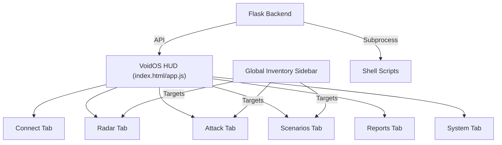

# 🖼️ VoidPWN HUD Tactical Manual

This guide illustrates the logic and navigation of the **VoidOS Dashboard V3**. Designed for tactical operations, it emphasizes one-touch control and global targeting.

## 📐 Console Architecture

---

## 🧭 Tab-by-Tab Breakdown

### 1. **CONNECT** (Uplink Management)
The Connect tab manages the Pi's physical network state.
- **WiFi Scan**: Uses `nmcli` to identify neighboring networks.
- **Connection**: Handles WPA2-Personal/Enterprise credentials.
- **Virtual Keyboard**: Activates for data entry on touch-only TFT screens.

### 2. **RADAR** (Spectrum Intelligence)
The Radar tab is where targets are born. 
- **Inventory List**: Shows every discovered device.
- **Target Selection**: Clicking a device makes it the **Active Target** for all other tools.
- **Details Modal**:
    - **Ports**: Shows open TCP/UDP ports discovered via Nmap.
    - **Intelligence**: Allows for persistent notes (e.g., "Main Server") and color-coded tags.

### 3. **ATTACK** (The Arsenal)
The heart of the pentesting console.
- **BSSID Targets**: WiFi attacks (Deauth, PMKID, MDK4) automatically target the network selected in the sidebar.
- **IP Targets**: Network attacks (Throttling, Recon) target the host selected in the inventory.
- **Chaos Mode**: Direct controls for `mdk4` modules.

### 4. **SCENARIOS** (Tactical Automation)
Chained sequences that automate 10-20 manual steps into one button.
- **Tutorial Logic**: Scenarios use a "Sequence of Events" (SoE) to handle tool dependencies (e.g., stopping scan before starting deauth).

### 5. **REPORTS** (Intelligence Feed)
A real-time, persistent log of every shell command executed.
- **Success/Warning/Critical**: Every API response is color-coded for quick review.
- **Persistence**: Results are saved even after page refresh.

### 6. **SYSTEM** (Hardware Control)
Kernel-level controls for the Raspberry Pi hardware.
- **Power**: ACPI shutdown/reboot controls.
- **Monitor Mode**: Toggles `airmon-ng` on/off for selected interfaces.
- **LCD/HDMI**: Switches the frame buffer for different displays.

---

## 🎯 Tutorial: The Global Target Workflow

1.  **Scan** in the Radar tab.
2.  **Toggle Details** on a target device.
3.  **Click TARGET** to lock it in. Notice the **Target Badge** at the top of the HUD updates.
4.  Switch to **Attack** or **Scenarios**. Your target is already pre-filled.
5.  **ENGAGE**.

---
*Reference: [USER_GUIDE.md](../USER_GUIDE.md) for technical flags.*
