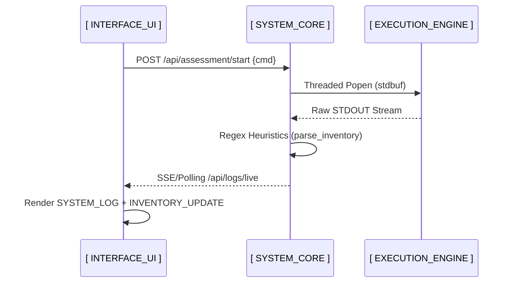

# [ // INTERFACE_MANUAL ] 
## [ // REAL-TIME_MONITORING_FRAMEWORK ]

This manual provides a technical overview of the VoidPWN Real-time Monitoring Interface, mapping its telemetry systems to the asynchronous system backend.

---

## [ // ARCHITECTURE_FLOW ]

The interface functions as a professional Single-Page Application (SPA) designed for low-latency system updates.

---

## [ // UI_ELEMENT_MAPPING ]

### 1. LIVE_SYSTEM_LOG (Terminal)
The primary system feed displaying raw process telemetry.
- **Backend Source**: `LIVE_LOGS` (circular `collections.deque` buffer).
- **Update Frequency**: Real-time push as lines are captured.
- **Status Indicators**:
    - `[✓] SUCCESS`: Process objectives complete.
    - `[✗] ERROR`: Subprocess failure or interface error.
    - `[!] ALERT`: Potential resource exhaustion or signal degradation.

### 2. HOST_INVENTORY (Device List)
Live tracking of identified network nodes.
- **Backend Source**: `DeviceManager` persistence (`devices.json`).
- **Trigger**: Updated by `parse_inventory_info()` whenever Nmap or ARP logs are detected in the stream.
- **Attributes**: IPv4, Hostname, MAC Address, Vendor ID.

### 3. SYSTEM_RESOURCE_MONITOR (System Metrics)
Real-time hardware performance metrics.
- **CPU_LOAD**: `psutil.cpu_percent()` - Monitors computational overhead.
- **RAM_USAGE**: `psutil.virtual_memory()` - Ensures persistence buffer stability.
- **TEMP_SYNC**: Monitors thermal levels during heavy WiFi injection.

### 4. MODULE_CONTROL_VECTORS (Control Vectors)
- **[ // NETWORK ]**: Interface for `recon.sh` (Network Assessment).
- **[ // WIFI ]**: Interface for `wifi_tools.sh` (Wireless Auditing).
- **[ // SCENARIOS ]**: High-level orchestration for automated security workflows.

---

## [ // TELEMETRY_SYNCHRONIZATION ]

The interface synchronizes its state based on the **Assessment Lifecycle**:

| Assessment State | Visual Indicator | Data Source |
| :--- | :--- | :--- |
| **INITIALIZING** | Pulse Animation (Yellow) | Subprocess initialization |
| **ACTIVE_PROCESS** | Scanning Animation (Green) | `proc.poll() is None` |
| **DATA_IDENTIFIED** | Item Update (White) | `parse_inventory_info()` |
| **COMPLETE** | Static Display (Green) | `proc.wait()` exit 0 |
| **FAILED** | Warning Indicator (Red) | Exit code > 0 |

---

## [ // INPUT_VECTORS ]

### VIRTUAL_INPUT_SUBSYSTEM
Interfaces with the terminal emulator for command input without external peripherals.
- **Logic**: Native DOM event interception.
- **Compatibility**: Optimized for the 3.5" resistive touch matrix.

---
*For direct script parameter definitions, refer to the [Technical Reference](./TECHNICAL_REFERENCE.md).*
