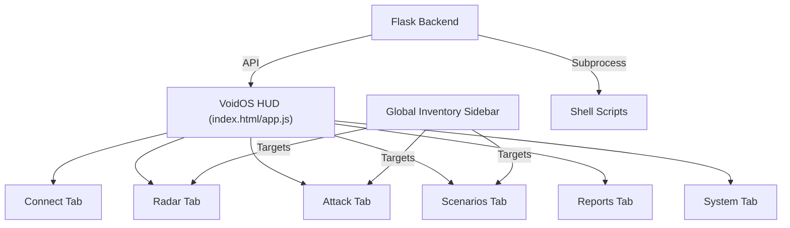

# 🖼️ VoidPWN HUD Tactical Manual

This guide illustrates the logic and navigation of the **VoidOS Dashboard V3**. Designed for tactical operations, it emphasizes one-touch control and global targeting.

## 📐 Console Architecture

---

## 🧭 Tab-by-Tab Breakdown

### 1. **CONNECT** (Uplink Management)
The Connect tab manages the Pi's physical network state.
- **WiFi Scan**: Uses `nmcli` to identify neighboring networks.
- **Connection**: Handles WPA2-Personal/Enterprise credentials.
- **Virtual Keyboard**: Activates for data entry on touch-only TFT screens.

# System Interface Manual

This manual provides a technical overview of the VoidPWN Head-Up Display (HUD), the primary web-based management console for the platform.

---

## Technical Architecture

The HUD is a single-page application (SPA) that interfaces with a Flask-based REST API. It is designed for low-latency operation and real-time process monitoring.

---

## Operational Modules

### 1. System Console
Located at the top of the interface, the console provides real-time system metrics:
- **CPU & Memory**: Real-time resource utilization monitoring.
- **Wireless Interface Status**: Indicates the current state of the primary monitoring interface (e.g., `wlan1`).
- **Authorization Status**: Displays the current session state.

### 2. Radar and Inventory
The primary module for host and signal management.
- **RADAR SCAN**: Triggers subnet-wide discovery or wireless signal mapping.
- **Global Inventory**: A unified tracking system that persists discovered assets (IPs, BSSIDs, MACs) into a centralized database (`output/devices.json`).
- **Target Selection**: Clicking an inventory item assigns it as the "Active Target," automatically prepopulating parameters for subsequent assessment tools.

### 3. Tactical Assessment Tabs
- **NETWORK**: Direct access to reconnaissance tools like Nmap, GoBuster, and SMB enumerators.
- **WIFI**: Interface for Layer 2 assessments including handshake capture, PMKID extraction, and WPS research.
- **SCENARIOS**: High-level automation triggers for pre-configured mission profiles.

### 4. Process Monitoring (The Command HUD)
The centralized display area provides real-time feedback from background processes.
- **Activity Log**: Displays timestamped events and system notifications.
- **Live Output**: Streams the `stdout` and `stderr` of active security tools, allowing for immediate observation of scan results.

### 5. Historical Reporting
The **REPORTS** tab serves as a centralized archive for all completed sessions.
- **Log Retrieval**: Access and download individual tool logs.
- **Capture Download**: Direct links to exported `.cap`, `.pcapng`, and `.nmap` files for offline analysis.

---

## User Interface Configuration

### Virtual Keyboard
For deployments utilizing touch-screen LCDs with limited physical input, an integrated virtual keyboard is provided for data entry in all parameter fields.

### Status Indicators
- **Green**: Service/Interface active and functioning correctly.
- **Yellow**: Process in progress or non-critical warning.
- **Red**: Error detected or vulnerable service identified.

---
*For technical implementation details, refer to the [Technical User Guide](../USER_GUIDE.md).*
