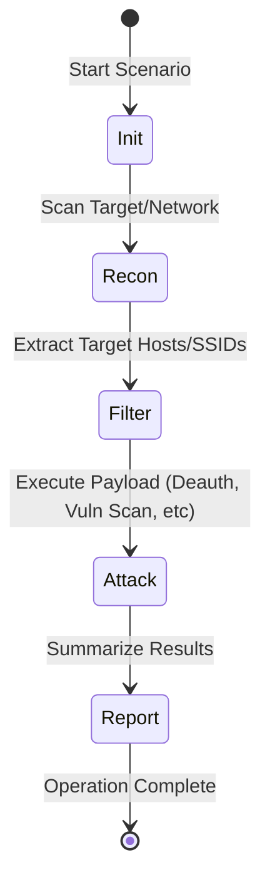

# 🤖 Scenario Automation Guide

Scenarios are the "Auto-Pilot" of VoidPWN. They chain together complex CLI tools to perform high-level missions with zero manual flag entry. 

## 🔄 How Scenarios Work

A scenario is a state-machine that follows a predefined script (`scenarios.sh`).

---

## 🏃 Available Mission Walkthroughs

### 1. **WiFi Audit (The "One-Button Hack")**
*   **Goal**: Find and test the security of all local WiFi APs.
*   **Workflow**:
    1.  Toggles **wlan1** into monitor mode.
    2.  Runs `airodump-ng` for 10 minutes to populate a list of BSSIDs.
    3.  Filters for networks with weak encryption or WPS enabled.
    4.  Sequential capture attempts on all high-signal targets.
*   **Tutorial Tip**: Running this during peak hours (e.g., afternoon) increases the chance of capturing active handshakes.

### 2. **Stealth Recon (Shadow Mission)**
*   **Goal**: Map a target network without being detected by Firewalls or IDS (Intrusion Detection Systems).
*   **Secrets of the Logic**:
    - **Timing (T2)**: Instead of the default T4, T2 sends packets slowly to blend into background noise.
    - **Fragmentation**: Splits up the TCP headers so a simple firewall can't read the full destination port initially.
    - **Decoy Field**: Includes 10 real-looking IP addresses in the packet source. The firewall sees 11 scans at once and cannot tell which one is the "true" Pi.

### 3. **Web Application Hunt (Service Discovery)**
*   **Goal**: Find vulnerabilities in every web-facing server on the network.
*   **Workflow**:
    1.  Discovery of common web ports (`80, 443, 8080, 8443`).
    2.  `WhatWeb` identifies the technology stack (e.g., Apache, Nginx, PHP).
    3.  `GoBuster` brute-forces directories searching for hidden admin panels or `/config` backups.
    4.  `Nikto` performs a final sweep for 6000+ known web vulnerabilities.

---

## 📊 Comparison: Which Scenario to Run?

| Mission | Speed | Detection Risk | Primary Tool | Best For |
| :--- | :--- | :--- | :--- | :--- |
| **WiFi Audit** | Medium | High | `Aircrack-ng` | WiFi Security Testing |
| **Stealth Recon** | SLOW | **ULTRA LOW** | `Nmap` | Bypassing Enterprise Security |
| **Web Hunt** | Fast | Medium | `GoBuster/Nikto` | Identifying Web Weaknesses |
| **Quick Assess** | **ULTRA FAST** | High | `Nmap` | Fast status check of a new LAN |

---

## 💡 Operative's Tip: Automated Persistence
Every scenario automatically saves its output into a timestamped folder: `output/scenarios/MISSION_TIME/`. You can browse these results at any time in the **REPORTS** tab of the HUD.

---
*Reference: [HUD_MANUAL.md](./HUD_MANUAL.md) for UI controls.*
