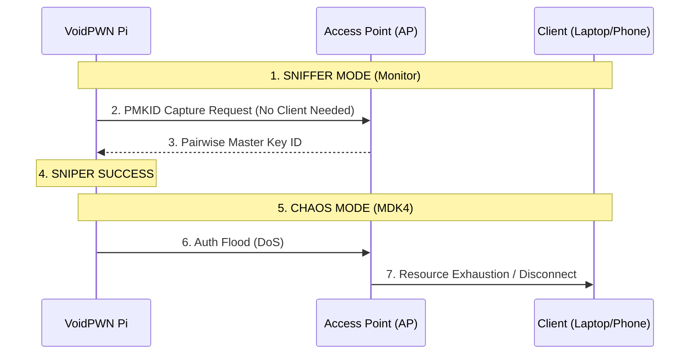

# ⚔️ WiFi Arsenal Tutorial

VoidPWN V3 introduces advanced Layer 2 attacks that move beyond simple "Deauthentication." This guide explains the physics and logic of these tools.

## 📡 The Wireless Kill-Chain

---

## 🔫 Weapon Systems

### 1. **PMKID Sniper** (`hcxdumptool`)
*   **Physics**: Exploits an optional field in the RSN IE of a WPA2 network.
*   **The "Tutorial" Edge**: Unlike standard handshake captures, **you do not need a connected client**.
*   **Command**: `hcxdumptool -o capture.pcapng -i wlan1mon --enable_status=1`
*   **When to use**: On empty/isolated networks where you can't wait for someone to log in.

### 2. **MDK4 Chaos Suite** (`mdk4`)
*   **Beacon Flood**: 
    - 🛰️ Broadcasts 100+ fake network names. 
    - **Effect**: Confuses WiFi scanners and users; makes "Evil Twin" networks harder to distinguish.
*   **Auth Flood**:
    - 🌊 Floods the AP with authentication requests from randomized MACs.
    - **Effect**: Overwhelms the AP's memory, forcing a crash or mass-reboot of all clients.

### 3. **WPS Pixie-Dust** (`reaver` / `pixiewps`)
*   **Physics**: Exploits low-entropy Nonces generated by specific WiFi chipsets (Broadcom, Realtek).
*   **The Tutorial**: VoidPWN automates the "Pixie" attack. If the router is vulnerable, you get the password in **under 10 seconds**, bypassing the 11,000-pin brute force.
*   **Command**: `reaver -i wlan1mon -b <BSSID> -K 1`

### 4. **Deauth & Evil Twin**
*   **Standard Deauth**: `aireplay-ng --deauth`
*   **Evil Twin**: Clones the Target BSSID and hosts a captive portal to harvest credentials. Best used in conjunction with **Beacon Flooding** to hide the real network.

---

## 🛠️ Hardware Requirements
To use these tools, your WiFi adapter **MUST** support **Monitor Mode** and **Packet Injection**.
1.  Go to the **SYSTEM** tab.
2.  Select `wlan1`.
3.  Click **MONITOR ON**.
4.  If the indicator turns green, you are ready for tactical engagement.

---
*Next: [SCENARIO_GUIDE.md](./SCENARIO_GUIDE.md) for automated workflows.*
